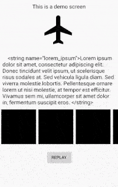

# Smoother
Animator Utlity class for smoother and quick ViewGroup animations like entry and exit transitions.<br>
<a href="https://medium.com/@sourabhgupta_49508/make-android-animations-choreography-fun-again-8163d5843a72?source=friends_link&sk=9165a9d280e8d3348ba528f11ea065dd">Link to Medium Story</a>

Download
--------

```
dependencies {
    implementation 'com.github.sourabhgupta811:smoother:0.0.1'
}
```

how to use
--------
```
    SmoothAnimator propagationTransition = new SmoothAnimator(frame_layout,
            demo_text,
            new TransitionSet()
                    .addTransition(new Fade(Fade.IN)).setInterpolator(new Interpolator() {
                @Override
                public float getInterpolation(float input) {
                    return (input - 0.5f) * 2;
                }
            }).addTransition(new TranslateAnimation(100, TranslateAnimation.Direction.BOTTTOM))
            , 300, null, null);
    propagationTransition.prepare();
    propagationTransition.startAnimation();
```

ScreenShots
--------
<br>

